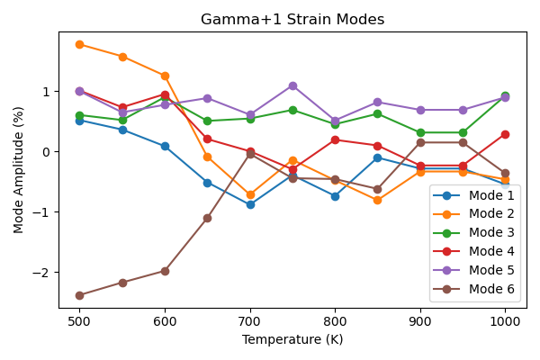
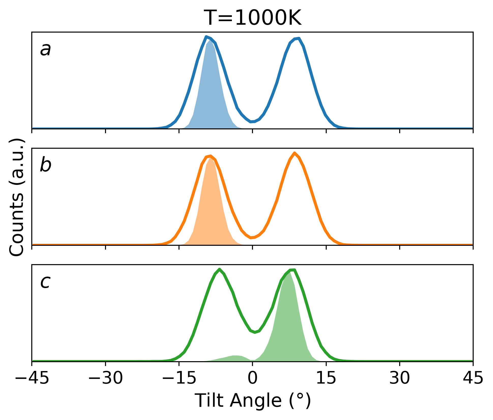
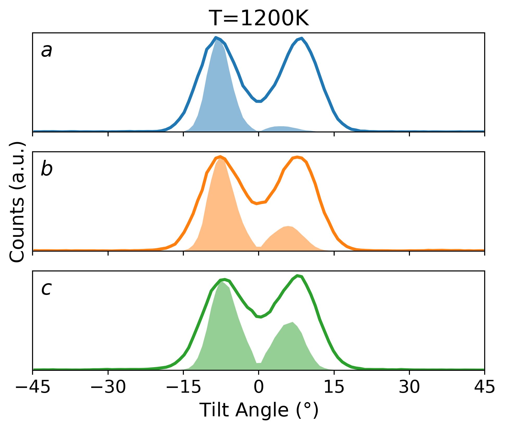
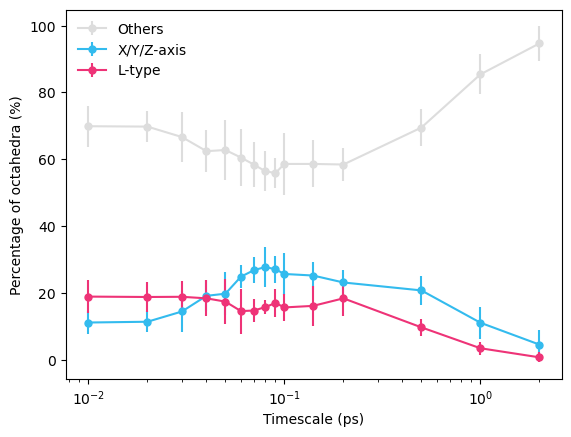
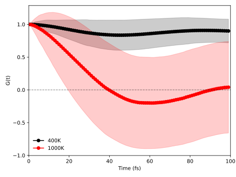
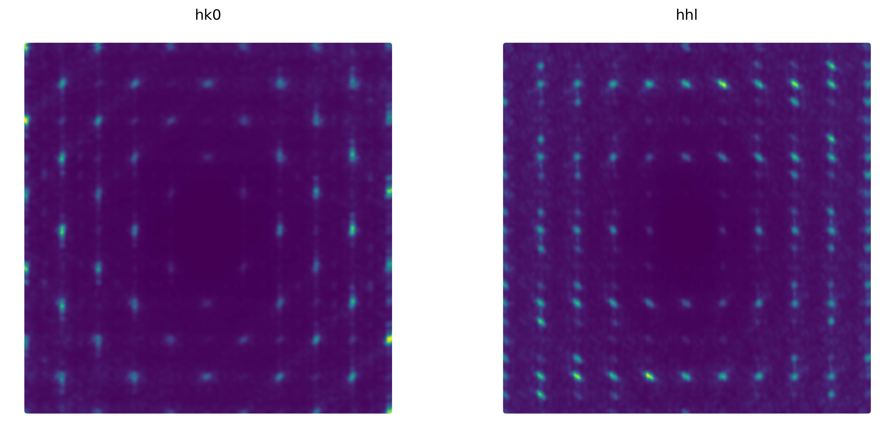

# Research data supporting "The Microscopic Nature of Orbital Disorder in LaMnO3"

## Model parametrisation

We train two [NequIP](https://github.com/mir-group/nequip) models using data from [Jansen *et al.*](https://doi.org/10.1103/PhysRevB.108.235122) One with a larger number of parameters for the $6 \times 6 \times 6$ supercell simulations and another with a smaller number of parameters for the 14x14x14 supercell simulations. Training input files and deployed models are given in [src](./src) folder.

## Strain analysis

Drawing inspiration from [Tragheim *et al.*](https://arxiv.org/pdf/2504.11153), the heating trajectory from 100 to 1,100 K can be further analysed in terms of the change in strain of the unit cell with temperature. The strain values have been calculated using [ISODISTORT](https://doi.org/10.1107/S0021889806014075). The supercell studied is in P1 symmetry and thus the 6  $\Gamma^{+}_1$ modes are shown. Mode 2 corresponds to a shear strain and is seen to decrease during the phase transition.

## High temperature rhombohedral phase

The model has been further tested by simulating MD beyond the temperature range of the training data. At 1,200 K, it reproduces the $a^{-}a^{-}a^{-}$ tilting pattern of the high temperature rhombohedral phase. Tilting pattern calculations were carried out using [PDynA](https://github.com/WMD-group/PDynA).

## Time-averaging

We use the smooth trajectory function from [OVITO](https://doi.org/10.1088/0965-0393/18/1/015012) for time-averaging. A comparison of different time-averaging windows is given in [data](./data) folder. The following figure shows the orientations of Jahn-Teller distortions (X/Y/Z-axis or L-type) against time-averaging windows as well as the proportion of octahedra that do not have exactly two long bonds (Others). It shows that the larger windows result in the averaging of the distorted octahedra to undistorted octahedra.

## Correlations of distortions at 1,000K

Correlation functions were calculated using vectors q($Q_2,Q_3$) for each octahedron. $G(t)=<q_0\cdot q_t>_t$ is an autocorrelation function calculating the change in distortions through time, showing the fluctuation timescale is $\sim 40$ fs.

## Single crystal diffuse scattering

Single crystal diffuse scattering patterns were calculated using snapshots of the $14 \times 14 \times 14$ supercell at 1,000 K with [scatty](https://doi.org/10.1107/S2053273318015632). The inputs are given in the [src](./src) folder and the patterns are given in the [data](./data) folder. To note, the patterns are calculated with a cubic reciprocal lattice for simplification, since the reference unit cell and the supercells are pseudo-cubic.

## Data analysis

All scripts for analysis and plotting are given the [src](./src) folder.
